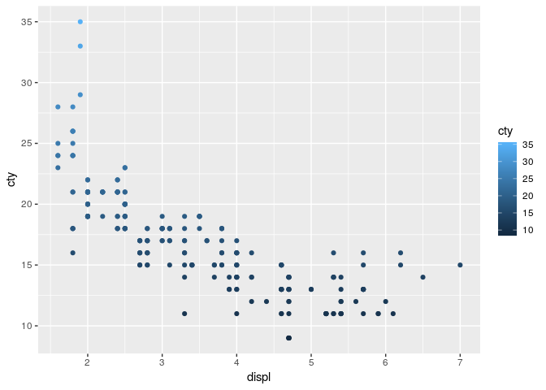
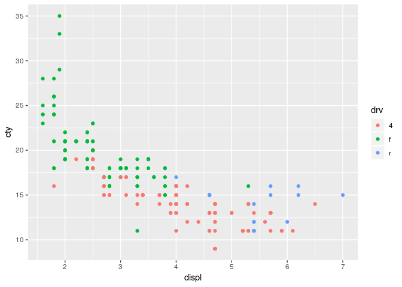
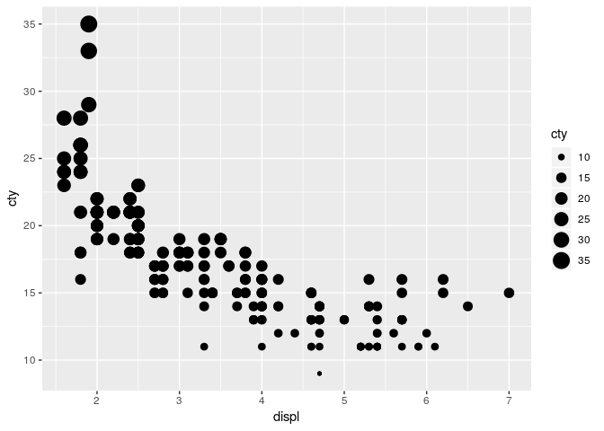
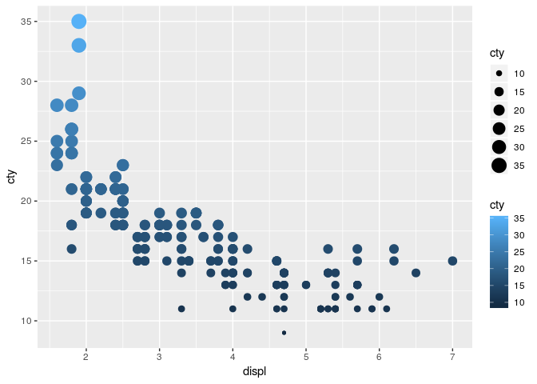
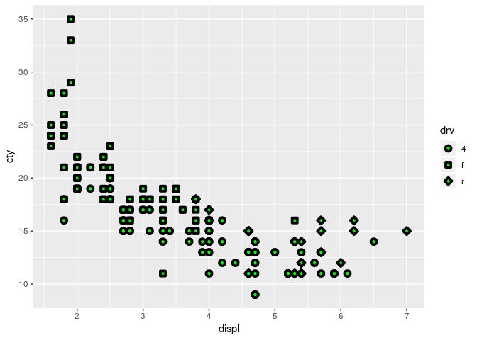
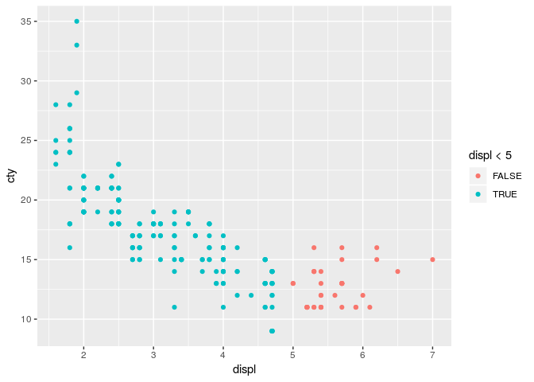

Homework 1: ggplot2
================
Robert Risti
2019-03-06

``` r
library(ggplot2)
```

By using *mpg* dataset:

1.  Map a continuous variable to color, size, and shape. How do these
    aesthetics behave differently for categorical vs. continuous
    variables?

<!-- end list -->

  - Color

<!-- end list -->

``` r
ggplot (data = mpg) +
  geom_point(mapping = aes(x = displ, y = cty, color = cty))
```

<!-- -->

``` r
#Mapping a continuous variable to color creates a color gradient depending on the value.  In this example, as mileage increases, the color goes from dark to light. 

#Using a categorical variable as an example:
ggplot (data = mpg) +
  geom_point(mapping = aes(x = displ, y = cty, color = drv))
```

<!-- -->

``` r
#Mapping a categorical variable to color would just assign different colors to different categories, without creating a distinct gradient.
```

  - Size

<!-- end list -->

``` r
ggplot (data = mpg) +
  geom_point(mapping = aes(x = displ, y = cty, size = cty))
```

<!-- -->

  - Shape

<!-- end list -->

``` r
#It is not possible to directly map a continous variable to shape (because shapes are inherently discerete in nature). Can be bypasssed by using scale_shape_identity to assign a shape to every data point but that is not practical and is limited by the amount of shapes available (127)
```

2.  What happens if you map the same variable to multiple aesthetics?

<!-- end list -->

``` r
ggplot (data = mpg) +
  geom_point(mapping = aes(x = displ, y = cty, color = cty, size = cty))
```

<!-- -->

3.  What does the stroke aesthetic do? What shapes does it work with?
    (Hint: use ?geom\_point)

<!-- end list -->

``` r
ggplot (data = mpg) +
  geom_point(mapping = aes(x = displ, y = cty, shape = drv),stroke = 2,fill = "green") + scale_shape_manual(values = c(21:23))
```

<!-- -->

``` r
#Stroke changes width of shape border, works with shapes that have a border
```

4.  What happens if you map an aesthetic to something other than a
    variable name, like aes(colour = displ \< 5)?

<!-- end list -->

``` r
ggplot (data = mpg) +
  geom_point(mapping = aes(x = displ, y = cty, color = displ < 5))
```

<!-- -->

``` r
#Using a conditional statement instead of a variable name assigns a different color to data points that meet the criteria
```
